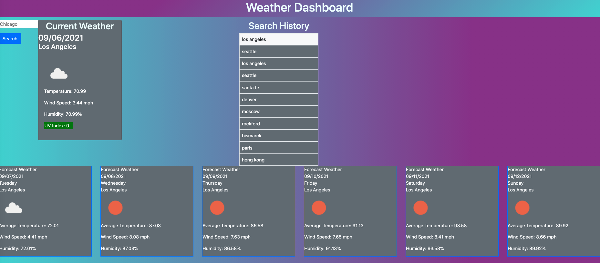
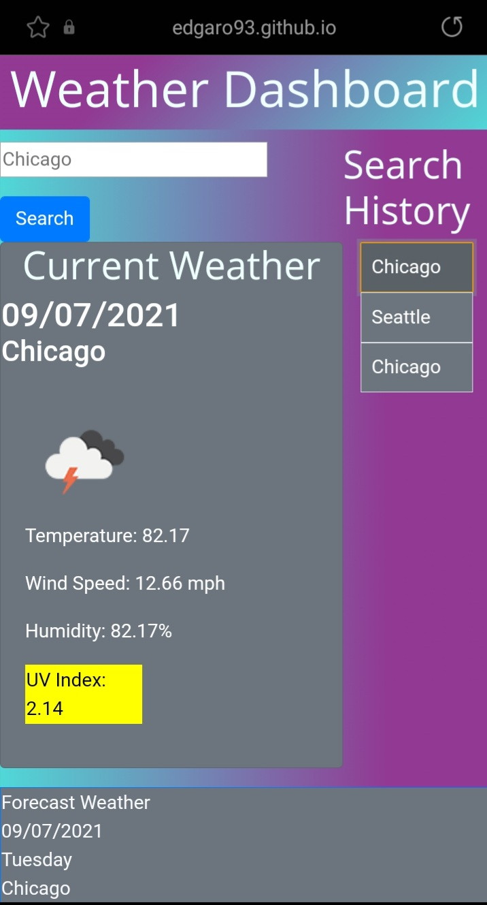
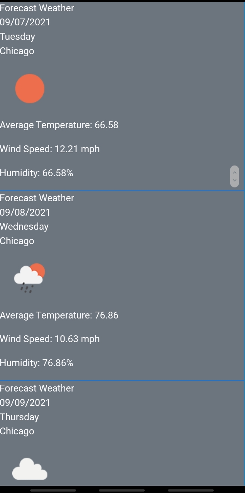

# Weather-Dashboard

Link: https://edgaro93.github.io/Weather-Dashboard/

## Description

This Weather Dashboard was created using Javascript, JQuery, and server side APIs from Open Weather. The dashboard lets you search for cities as well creating a search history and letting you click on it to revisit the weather information.  I was able to pull from multiple APIs to get the current weather, forecast and UV index information. The current weather will give you temperature, wind speed, humidity and UV index. The UV index is color coded depending on good, moderate and severe conditions. I was challenged to get the information with one API call so I did multiple and also with figuring out how to make the buttons work on the search history. I ended up re-writing my code twice over to add similar functions. In future updates, I would like to rewrite my code to make it more efficient. I would also like to add an alert for no city, change the design of the weather and add more information in future updates.

## Screenshot
Desktop view

Mobile view

## Acknowlegments
~~~
I would like to thank my tutor and TAs as well online resources such as W3 schools, MDN Web Docs, and Stack Overflow.
~~~
